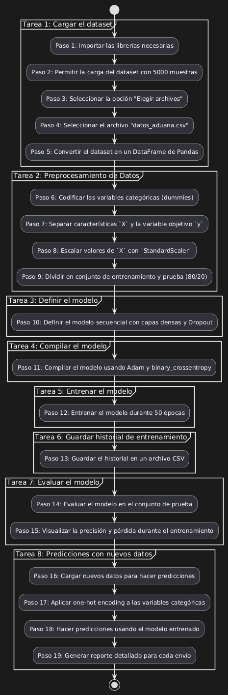
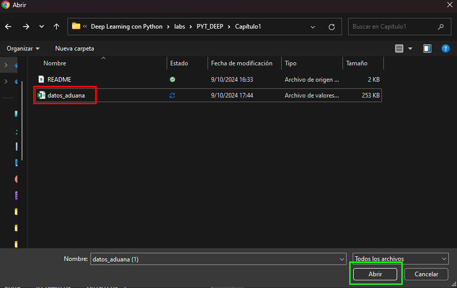
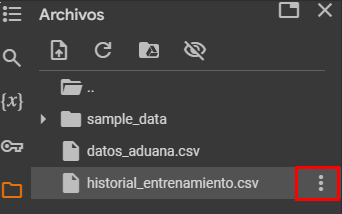
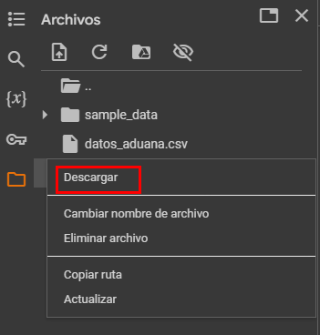
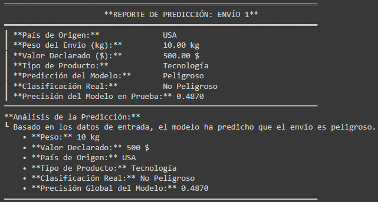

# Práctica 1. Primera clasificación de Productos Peligrosos Usando Deep Learning

## Objetivo de la práctica:

Al final de la actividad, serás capaz de:

- Desarrollar un modelo de redes neuronales que clasifique productos como peligrosos o no peligrosos, utilizando características como peso, valor declarado, país de origen y tipo de producto. <br>
- Comprender las métricas de rendimiento para que a lo largo del curso optimices este primer modelo creado.

## Objetivo visual:



## Duración aproximada:

- 50 minutos.

## Instrucciones 

### **CONFIGURACIÓN DEL ENTORNO DE TRABAJO**

Dentro de Google Drive, seleccionar `Nuevo`.


Dar clic en `Más` y `Conectar con más aplicaciones`.


En el buscador, escribe `Colab` y selecciona `Colaboratory.


Da clic en `Instalar`.


En `Nuevo`, haz clic en `Colaboratory`.


Cuando se abra un nuevo archivo, selecciona `Entorno de ejecución`.


Selecciona `Cambiar tipo de entorno de ejecución`.


Seleccionar `T4 GPU` y da clic en `Guardar`.


Finalmente, conéctate a los recursos seleccionados.


### Tarea 1. Cargar el dataset.

Paso 1. Importa las librerías necesarias para el proyecto:

```python
import pandas as pd
import numpy as np
import seaborn as sns
import matplotlib.pyplot as plt
from sklearn.model_selection import train_test_split
from google.colab import files
from sklearn.preprocessing import StandardScaler
import tensorflow as tf
from tensorflow.keras import layers, models
```
Paso 2. Permite que Colab acceda a la carga del dataset con 5000 muestras y 5 columnas, de las cuales la red aprenderá para llegar a una futura predicción:

```python
uploaded = files.upload()
```
Paso 3. Selecciona la opción de "Elegir archivos".

 

Paso 4. Selecciona el archivo "datos_aduana.csv" y da clic en "Abrir".



Paso 5. Convierte el dataset en un DataFrame de Pandas, el cual es una estructura de datos bidimensional similar a una tabla (filas y columnas). Contiene los siguientes datos:

  - `peso`: Un valor entre 0.5 y 50 TON.
  - `valor_declarado`: Un valor entre 100 y 10,000 dólares.
  - `pais_origen`: Uno de los cinco países ('USA', 'CHN', 'MEX', 'DEU', 'JPN').
  - `tipo_producto`: Un tipo de producto ('Tecnología', 'Ropa', 'Alimentos', 'Químicos').
  - `es_peligroso`: Una etiqueta binaria que indica si el producto es peligroso (`1`) o no (`0`).

  ```python
df = pd.read_csv('datos_aduana.csv')
```
### Tarea 2. Preprocesamiento de datos.

Paso 1. Preprocesa los datos cargados antes de que ingresen a la red mediante la codificación de las variables categóricas: Las columnas categóricas (`pais_origen` y `tipo_producto`) son transformadas a variables dummies (variables binarias) mediante `pd.get_dummies()`, eliminando la primera columna de cada categoría para evitar colinealidad.

```python
df_encoded = pd.get_dummies(df, columns=['pais_origen', 'tipo_producto'], drop_first=True)
```

Paso 2. Separa los parámetros que usará la red y define la predicción que realizará:

  - `X`: Las características (peso, valor declarado, país, tipo de producto).
  - `y`: La etiqueta de clasificación (`es_peligroso`).

```python
X = df_encoded.drop('es_peligroso', axis=1).values
y = df_encoded['es_peligroso'].values
```

Paso 3. Escala los valores de `X` a una distribución estándar (media 0, desviación estándar 1) usando `StandardScaler()`. Esto es importante para mejorar el rendimiento de las redes neuronales.

```python
scaler = StandardScaler()
X_scaled = scaler.fit_transform(X)
```

Paso 4. Divide el dataset en: un conjunto de entrenamiento (80%) y un conjunto de prueba (20%) con `train_test_split()`.

```python
X_train, X_test, y_train, y_test = train_test_split(X_scaled, y, test_size=0.2, random_state=42)
```

### Tarea 3. Definir el modelo.

Paso 1. Define una red neuronal secuencial con varias capas:

  - **Capa densa (32 neuronas)**: La primera capa tendrá 32 neuronas con activación ReLU y recibirá como entrada las características de `X_train`. <br>
  - **Capa de Dropout**: El Dropout (20%) servirá para prevenir el sobreajuste, apagando aleatoriamente un porcentaje de neuronas durante el entrenamiento.<br>
  - **Capa densa (16 neuronas)**: En la segunda capa se definirán 16 neuronas y activación ReLU.<br>
  - **Capa de Dropout**: Nuevamente se usa Dropout del 20%.<br>
  - **Capa densa (8 neuronas)**: Tercera capa con 8 neuronas y activación ReLU.<br>
  - **Capa de salida (1 neurona)**: La última capa usa activación `sigmoid` para producir un valor entre 0 y 1, que representa la probabilidad de que el producto sea peligroso.<br>

```python
model = models.Sequential([
    layers.Dense(32, activation='relu', input_shape=(X_train.shape[1],)),
    layers.Dropout(0.2),
    layers.Dense(16, activation='relu'),
    layers.Dropout(0.2),
    layers.Dense(8, activation='relu'),
    layers.Dense(1, activation='sigmoid')
])
```

### Tarea 4. Compilar el modelo.

Paso 1. Compila el modelo usando **Adam** como optimizador, una función de pérdida `binary_crossentropy` y obtén las métricas de calidad del modelo durante el entrenamiento:

```python
model.compile(optimizer='adam', loss='binary_crossentropy', metrics=['accuracy'])
```

### Tarea 5. Entrenar el modelo.

Paso 1. Entrena el modelo durante 50 épocas con un tamaño de lote de 64. Reserva el 20% de los datos de entrenamiento como conjunto de validación para medir el rendimiento del modelo durante el entrenamiento.

```python
history = model.fit(X_train, y_train, epochs=50, batch_size=64, validation_split=0.2)
```

### Tarea 6. Guardar el historial de entrenamiento.

Paso 1. Guarda y descarga el historial de entrenamiento, el cual incluye la precisión y la pérdida en cada época en un archivo CSV llamado `historial_entrenamiento.csv`.

```python
hist_df = pd.DataFrame(history.history)
hist_df.to_csv('historial_entrenamiento.csv', index=False)
```
 

 

### Tarea 7. Evaluar el modelo.

Paso 1. Evalúa el modelo usando los datos de prueba e imprimir la precisión alcanzada.

```python
loss, accuracy = model.evaluate(X_test, y_test)
print(f'Precisión en el conjunto de prueba: {accuracy:.4f}')
```

Paso 2. Visualiza la precisión y pérdida del modelo.

```python
plt.figure(figsize=(12, 5))

plt.subplot(1, 2, 1)
plt.plot(history.history['accuracy'], label='Precisión de Entrenamiento')
plt.plot(history.history['val_accuracy'], label='Precisión de Validación')
plt.title('Precisión del Modelo')
plt.xlabel('Épocas')
plt.ylabel('Precisión')
plt.legend()

plt.subplot(1, 2, 2)
plt.plot(history.history['loss'], label='Pérdida de Entrenamiento')
plt.plot(history.history['val_loss'], label='Pérdida de Validación')
plt.title('Pérdida del Modelo')
plt.xlabel('Épocas')
plt.ylabel('Pérdida')
plt.legend()

plt.tight_layout()
plt.show()
```

Paso 3. Carga nuevos datos para hacer predicciones.

```python
nuevos_datos = {
    'peso': [10, 25, 40, 15, 30, 45, 20, 35, 5, 50],
    'valor_declarado': [500, 3000, 8000, 1500, 7000, 1000, 2500, 6000, 200, 9000],
    'pais_origen': ['USA', 'CHN', 'DEU', 'MEX', 'USA', 'CHN', 'DEU', 'MEX', 'USA', 'CHN'],
    'tipo_producto': ['Tecnología', 'Ropa', 'Alimentos', 'Químicos', 'Tecnología', 'Ropa', 'Alimentos', 'Químicos', 'Tecnología', 'Ropa'],
    'es_peligroso_real': [0, 1, 1, 0, 0, 1, 0, 1, 0, 1]  # Valores reales
}
df_nuevos = pd.DataFrame(nuevos_datos)
```

Paso 4. Aplica **one-hot encoding** a las variables categóricas (país de origen y tipo de producto) para convertirlas en variables numéricas. 

```python
df_nuevos_encoded = pd.get_dummies(df_nuevos, columns=['pais_origen', 'tipo_producto'], drop_first=True)
df_nuevos_encoded = df_nuevos_encoded.reindex(columns=df_encoded.columns[:-1], fill_value=0)
X_nuevos_scaled = scaler.transform(df_nuevos_encoded)
```

Paso 5. Realiza predicciones para los nuevos datos y usa un umbral de 0.5 para clasificar los resultados como **peligroso (1)** o **no peligroso (0)**.

```python
predicciones = model.predict(X_nuevos_scaled)
predicciones_clasificadas = (predicciones > 0.5).astype(int)
```

Paso 6. Genera un **reporte detallado** para cada uno de los nuevos envíos e incluir la información del envío (país de origen, peso, valor declarado, tipo de producto) y la **predicción del modelo** comparada con la **clasificación real**.

```python
for i, prediccion in enumerate(predicciones_clasificadas):
    print("═════════════════════════════════════════════════════════════════════")
    print(f"                      **REPORTE DE PREDICCIÓN: ENVÍO {i+1}**")
    print("═════════════════════════════════════════════════════════════════════")
    print(f"┃ **País de Origen:**              {df_nuevos.iloc[i]['pais_origen']}")
    print(f"┃ **Peso del Envío (kg):**         {df_nuevos.iloc[i]['peso']:.2f} kg")
    print(f"┃ **Valor Declarado ($):**         {df_nuevos.iloc[i]['valor_declarado']:.2f} $")
    print(f"┃ **Tipo de Producto:**            {df_nuevos.iloc[i]['tipo_producto']}")
    print(f"┃ **Predicción del Modelo:**       {'Peligroso' if prediccion == 1 else 'No Peligroso'}")
    print(f"┃ **Clasificación Real:**          {'Peligroso' if df_nuevos.iloc[i]['es_peligroso_real'] == 1 else 'No Peligroso'}")
    print(f"┃ **Precisión del Modelo en Prueba:** {accuracy:.4f}")
    print("═════════════════════════════════════════════════════════════════════")
    
    print("**Análisis de la Predicción:**")
    print(f"┗ Basado en los datos de entrada, el modelo ha predicho que el envío es {'peligroso' if prediccion == 1 else 'no peligroso'}.")
    print(f"    • **Peso:** {df_nuevos.iloc[i]['peso']} kg")
    print(f"    • **Valor Declarado:** {df_nuevos.iloc[i]['valor_declarado']} $")
    print(f"    • **País de Origen:** {df_nuevos.iloc[i]['pais_origen']}")
    print(f"    • **Tipo de Producto:** {df_nuevos.iloc[i]['tipo_producto']}")
    print(f"    • **Clasificación Real:** {'Peligroso' if df_nuevos.iloc[i]['es_peligroso_real'] == 1 else 'No Peligroso'}")
    print(f"    • **Precisión Global del Modelo:** {accuracy:.4f}")
    print("═════════════════════════════════════════════════════════════════════\n")
```

### Resultado esperado:

 
