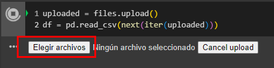

# Práctiac 2. Optimización de modelos de deep learning para clasificación de productos peligrosos

## Objetivo de la práctica:

Al finalizar la actividad, serás capaz de:

- Entender el proceso de optimización de Deep Learning y realizar comparaciones efectivas entre diferentes enfoques.

## Objetivo visual:


## Duración aproximada:

- 55 minutos.

## Instrucciones:

### Configuración del entorno de trabajo.

Dentro de Google Drive, seleccionar `Nuevo`


Dar clic en `Más` y `Conectar con más aplicaciones`


En el buscador escribir `Colab` y seleccionar el que dice `Colaboratory`


Dar clic en `Instalar`


En `Nuevo`, seleccionar `Colaboratory`


Cuando se abra un nuevo archivo, seleccionar `Entorno de ejecución`


Seleccionar `Cambiar tipo de entorno de ejecución`


Seleccionar `T4 GPU` y dar clic en `Guardar`


Finalmente, conectarse a los recursos seleccionados


### Tarea 1. **Cargar el dataset**
Paso 1. Instalar la libreria de SciKeras

```python
!pip install scikeras
```

Paso 2. Importar las librerías necesarias para el proyecto:
```python
import pandas as pd
import seaborn as sns
import matplotlib.pyplot as plt
from sklearn.model_selection import StratifiedKFold, RandomizedSearchCV, cross_val_predict
from sklearn.preprocessing import StandardScaler
from sklearn.metrics import accuracy_score, precision_score, recall_score, f1_score, classification_report, confusion_matrix
from tensorflow import keras
from tensorflow.keras import models, layers, regularizers
from scikeras.wrappers import KerasClassifier  
from scipy.stats import uniform
from google.colab import files
import numpy as np
```

Paso 3. Permitir que Colab acceda a la carga del dataset con 5000 muestras y 5 columnas de las cuales la red aprenderá para llegar a una futura predicción:

```python
uploaded = files.upload()  
df = pd.read_csv(next(iter(uploaded))) 
```
Paso 4. Seleccionar la opción de *Elegir archivos*

 

Paso 5. Seleccionar el archivo `dataset_aduanas_cap2.csv` y dar clic en *Abrir*


Paso 6. Imprimir la distribución de la variable objetivo es_peligroso, que indica si un producto es peligroso o no y devuelva las proporciones de cada clase (peligroso y no peligroso) en lugar de los conteos absolutos.

```python
print("\nDistribución de la variable objetivo:")
print(df['es_peligroso'].value_counts(normalize=True))
```

Paso 7. Visualizar la distribución de la variable `es_peligroso`.

```python
sns.countplot(x='es_peligroso', data=df)
plt.title('Distribución de Productos Peligrosos y No Peligrosos')
plt.show()
```

Paso 8. Crear un gráfico de barras que muestre cómo se distribuyen los productos peligrosos y no peligrosos según su tipo de cargamento y rotar las etiquetas del eje x para mejorar la legibilidad.


```python
plt.figure(figsize=(10, 6))
sns.countplot(x='tipo_producto', hue='es_peligroso', data=df)
plt.title('Tipo de Producto vs Peligrosidad')
plt.xticks(rotation=45)
plt.show()
```

Paso 9. Crear un gráfico muestra la distribución de la peligrosidad según el país de origen de los productos.

```python
plt.figure(figsize=(10, 6))
sns.countplot(x='pais_origen', hue='es_peligroso', data=df)
plt.title('País de Origen vs Peligrosidad')
plt.xticks(rotation=45)
plt.show()
```

Paso 10. Convertir las variables categóricas `pais_origen` y `tipo_producto` en variables dummy (0/1) para que puedan ser utilizadas por el modelo, y evite la multicolinealidad eliminando una de las categorías.

```python
df_encoded = pd.get_dummies(df, columns=['pais_origen', 'tipo_producto'], drop_first=True)
```

Paso 11. Tratar los valores atípicos en las columnas `peso` y `valor_declarado`  limitándolos al rango del percentil 1 al 99. 

```python
df_encoded['peso'] = df_encoded['peso'].clip(lower=df_encoded['peso'].quantile(0.01), upper=df_encoded['peso'].quantile(0.99))
df_encoded['valor_declarado'] = df_encoded['valor_declarado'].clip(lower=df_encoded['valor_declarado'].quantile(0.01), upper=df_encoded['valor_declarado'].quantile(0.99))
```

Paso 12. Separar las características (features) `X` de la variable objetivo (target) `y`. 

```python
X = df_encoded.drop('es_peligroso', axis=1)
y = df_encoded['es_peligroso']
```

Paso 13. Normalizar las características numéricas (en este caso `peso` y `valor_declarado`) utilizando `StandardScaler`.

```python
numeric_features = ['peso', 'valor_declarado']
scaler = StandardScaler()
X[numeric_features] = scaler.fit_transform(X[numeric_features])
```

Paso 14. Definir el número de folds para la validación cruzada

```python
kfold = StratifiedKFold(n_splits=5, shuffle=True, random_state=42)
```

### Tarea 2. **Definir el modelo**

Paso 15. Crear una función para el modelo de red neuronal. Utiliza `Dense` para agregar capas densas, `Dropout` para evitar el sobreajuste y regularización L2 para penalizar pesos grandes.

```python
def create_model(optimizer='adam', activation='relu', dropout_rate=0.0, neurons=32, l2_value=0.01):
    model = models.Sequential()
    model.add(layers.Dense(neurons, input_dim=X.shape[1], activation=activation,
                           kernel_regularizer=regularizers.l2(l2_value)))
    model.add(layers.Dropout(dropout_rate))
    model.add(layers.Dense(int(neurons / 2), activation=activation,
                           kernel_regularizer=regularizers.l2(l2_value)))
    model.add(layers.Dropout(dropout_rate))
    model.add(layers.Dense(1, activation='sigmoid'))
    return model
```

Paso 16. Crear un clasificador de Keras envolviendo el modelo previamente definido, lo que permite integrarlo con scikit-learn.

```python
model = KerasClassifier(
    model=create_model,
    loss='binary_crossentropy',
    metrics=['accuracy'],
    verbose=0  
)
```

### Tarea 5. **Definir el espacio de búsqueda para hiperparámetros**

Paso 17. Crear un diccionario `param_dist` que especifica los hiperparámetros que se van a ajustar, incluyendo el optimizador, la activación de la capa, tasa de dropout, número de neuronas, valor de L2, tamaño del batch y número de épocas.

```python
param_dist = {
    'optimizer': ['SGD', 'Adam'],
    'model__activation': ['relu', 'tanh'],
    'model__dropout_rate': uniform(0.1, 0.5),
    'model__neurons': [32, 64, 128],
    'model__l2_value': uniform(0.001, 0.02),
    'fit__batch_size': [32, 64],
    'fit__epochs': [30, 50]
}
```

Paso 18. Configurar `RandomizedSearchCV` para realizar la búsqueda aleatoria de los mejores hiperparámetros, utilizando la validación cruzada definida anteriormente.

```python
random_search = RandomizedSearchCV(
    estimator=model,
    param_distributions=param_dist,
    n_iter=3, 
    cv=kfold,
    verbose=2,
    random_state=42,
    n_jobs=1
)
```

Paso 19. Ejecutar la búsqueda aleatoria sobre los datos de entrenamiento `X` y las etiquetas `y`. El modelo tiene que entrenarse utilizando diferentes combinaciones de hiperparámetros.

```python
random_search_result = random_search.fit(X, y)
```

Paso 20. Imprimir los mejores hiperparámetros que se encontraron durante la búsqueda.

```python
print("Mejores hiperparámetros encontrados:")
print(random_search_result.best_params_)
```

Paso 21. Obtener el mejor modelo entrenado con los mejores hiperparámetros encontrados.

```python
best_model = random_search_result.best_estimator_
```

### Tarea 3. **Realizar predicciones con validación cruzada**

Paso 22. Hacer predicciones utilizando validación cruzada para obtener `y_pred`, que contiene las predicciones para cada instancia en `X.

```python
y_pred = cross_val_predict(best_model, X, y, cv=kfold, method='predict')
```

### Tarea 4. **Calcular y mostrar la matriz de confusión**

Paso 23. Determinar la matriz de confusión y la visualiza utilizando `seaborn`. Muestra cuántas instancias fueron clasificadas correctamente y cuántas fueron mal clasificadas.

```python
conf_matrix = confusion_matrix(y, y_pred)
plt.figure(figsize=(8, 6))
sns.heatmap(conf_matrix, annot=True, fmt='d', cmap='Blues')
plt.title('Matriz de Confusión')
plt.xlabel('Predicción')
plt.ylabel('Real')
plt.show()
```

Paso 24. Imprimir un reporte de clasificación que incluye métricas como precisión, recall y F1-score para evaluar el rendimiento del modelo.

```python
print("Reporte de Clasificación:")
print(classification_report(y, y_pred))
```

### Tarea 5. **Obtener las métricas**

Paso 25. Guardar el DataFrame df, que contiene el historial del entrenamiento, en un archivo CSV llamado historial_entrenamiento_lab2.csv.

```python
df.to_csv('historial_entrenamiento_lab2.csv', index=False)
```

Paso 26. Cargar el archivo CSV que contiene las métricas del modelo optimizado previamente guardadas en un DataFrame e imprimir las métricas almacenadas.

```python
metrics_df_optimizado = pd.read_csv('/content/historial_entrenamiento_lab2.csv')
print("Métricas del modelo optimizado:")
print(metrics_df_optimizado)
```

Paso 27. Calcular las métricas de evaluación del modelo optimizado

```python
accuracy = accuracy_score(y, y_pred)
precision = precision_score(y, y_pred)
recall = recall_score(y, y_pred)
f1 = f1_score(y, y_pred)
```

Paso 28. Crear un diccionario llamado `metrics` para almacenar las métricas calculadas del segundo modelo para organizar y acceder a las métricas.

```python
metrics = {
    'accuracy': accuracy,
    'precision': precision,
    'recall': recall,
    'f1_score': f1
}
```

Paso 29. Imprimir las métricas almacenadas en el diccionario `metrics` con 4 decimales.

```python
print("\nMétricas del modelo optimizado:")
for key, value in metrics.items():
    print(f"{key}: {value:.4f}")
```

Paso 30. Cargar el archivo CSV con las métricas del primer modelo.

```python
uploaded = files.upload()  
metrics_df_capitulo_1 = pd.read_csv('/content/historial_entrenamiento.csv')
print("Métricas del primer modelo:")
print(metrics_df_capitulo_1)
```

### Tarea 6. **Comparar resultados**

Paso 31. Obtener las métricas de los dos modelos como listas

```python
metrics_model_1 = metrics_df_capitulo_1.iloc[0].values[1:] 
metrics_model_2 = [metrics['accuracy'], metrics['precision'], metrics['recall']]
```

Paso 32. Ajustar las listas para que tengan la misma longitud 

```python
max_length = max(len(metrics_model_1), len(metrics_model_2))
metrics_model_1 = list(metrics_model_1) + [0] * (max_length - len(metrics_model_1))
metrics_model_2 = metrics_model_2 + [0] * (max_length - len(metrics_model_2))
```

paso 33. Filtrar solo las métricas que ambos modelos tienen en común (precisión, exactitud, y recall) para poder hacer una comparación adecuada.

```python
metric_names = ['accuracy', 'precision', 'recall']
filtered_model_1 = [metrics_model_1[i] for i in range(len(metrics_model_1)) if i < len(metric_names)]
filtered_model_2 = [metrics_model_2[i] for i in range(len(metrics_model_2)) if i < len(metric_names)]
```

Paso 34. Crear un DataFrame para comparar las métricas

```python
comparison_df = pd.DataFrame({
    'Métrica': metric_names,
    'Modelo Capítulo 1': filtered_model_1,
    'Modelo Optimizado': filtered_model_2
})
```

Paso 35. Visualizar la comparación de métricas

```python
comparison_df.set_index('Métrica').plot(kind='bar', figsize=(10, 6))
plt.title('Comparación de Métricas de Modelos')
plt.ylabel('Valor')
plt.xticks(rotation=0)
plt.legend(title='Modelo')
plt.show()
```

### Resultado esperado
 
