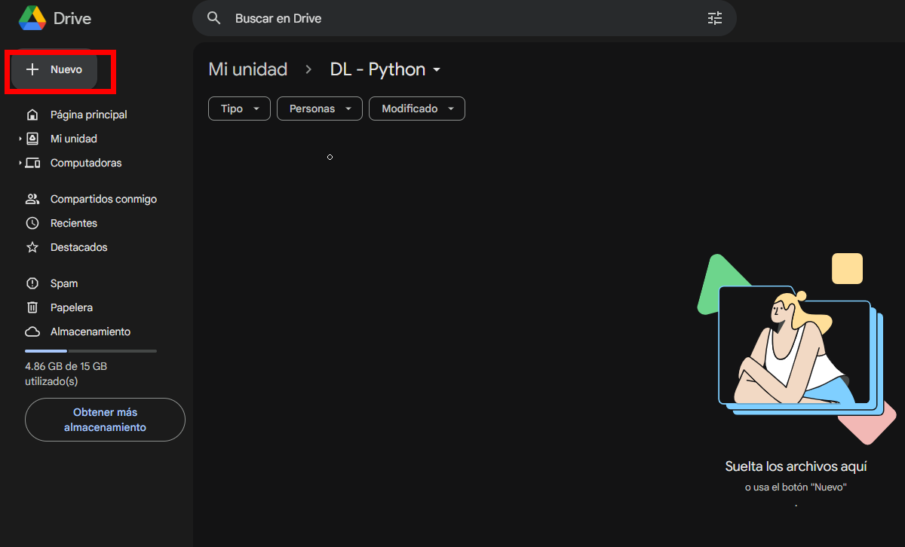

# Clasificación de Imágenes de Flores Usando Redes Neuronales Convolucionales desde Cero y Modelos Preentrenados

## Objetivo de la práctica:
Al finalizar la actividad, serás capaz de crear un modelo de red neuronal convolucional desde cero para clasificar imágenes, y utilizar un modelo preentrenado como MobileNetV2 para mejorar la precisión en la clasificación, aplicando técnicas de ajuste fino y comparación de resultados.


## Objetivo Visual 


## Duración aproximada:
- 50 minutos.

## Instrucciones 

### **CONFIGURACIÓN DEL ENTORNO DE TRABAJO**

Dentro de Google Drive, seleccionar `Nuevo`



Dar clic en `Más` y `Conectar con más aplicaciones`


En el buscador escribir `Colab` y seleccionar el que dice `Colaboratory`


Dar clic en `Instalar`


En `Nuevo`, seleccionar `Colaboratory`


Cuando se abra un nuevo archivo, seleccionar `Entorno de ejecución`


Seleccionar `Cambiar tipo de entorno de ejecución`


Seleccionar `T4 GPU` y dar clic en `Guardar`


Finalmente, conectarse a los recursos seleccionados


### Tarea 1. **Cargar el dataset "tf_flowers"**
Paso 1. Cargar el conjunto de datos en forma de pares (imagen, etiqueta).

```python
import tensorflow as tf
import tensorflow_datasets as tfds
from tensorflow.keras.preprocessing.image import ImageDataGenerator
from tensorflow.keras.models import Sequential
from tensorflow.keras.layers import Conv2D, MaxPooling2D, Flatten, Dense, Dropout, Input
from tensorflow.keras.preprocessing import image
import numpy as np
import matplotlib.pyplot as plt

dataset, info = tfds.load('tf_flowers', as_supervised=True, with_info=True)
```

Paso 2. Definir el tamaño de las imágenes (`IMG_SIZE`) redimensionándolo a 128x128 píxeles, ylel tamaño del lote será de 32

```python
IMG_SIZE = (128, 128)
BATCH_SIZE = 32
```

### Tarea 2. **Preprocesar imágenes**

Paso 3. Definir la función de preprocesamiento que redimensiona las imágenes a 128x128 píxeles y normalizarlas dividiendo cada valor de píxel por 255 para que estén en el rango [0, 1].

```python
def preprocess(image, label):
    image = tf.image.resize(image, IMG_SIZE)
    image = image / 255.0
    return image, label
```

### Tarea 3. **Dividir en conjunto de entrenamiento y validación**

Paso 4. Dividir el conjunto de datos en entrenamiento (80%) y validación (20%).

```python
train_size = int(0.8 * info.splits['train'].num_examples)
val_size = info.splits['train'].num_examples - train_size

train_dataset = dataset['train'].take(train_size).map(preprocess).batch(BATCH_SIZE).shuffle(1024)
val_dataset = dataset['train'].skip(train_size).map(preprocess).batch(BATCH_SIZE)
```

### Tarea 3. **Construir el modelo CNN**

Paso 5. Crear un modelo secuencial de red neuronal con las siguientes capas:

- **Capa de entrada**: acepta imágenes de tamaño 128x128 con 3 canales de color (RGB).
- **Capas convolucionales**: tres capas convolucionales con 32, 64 y 128 filtros, respectivamente, usando funciones de activación `relu`. Estas capas detectan características en las imágenes.
- **Capas de MaxPooling**: después de cada convolución, se aplica un MaxPooling 2x2 para reducir el tamaño de las características y evitar sobreajuste.
- **Capa de Flatten**: aplana las características en un vector para la capa densa.
- **Capa densa**: tiene 256 neuronas con activación `relu`, seguida de una capa de Dropout (50%) para regularizar.
- **Capa de salida**: usa `softmax` con 5 neuronas, una para cada categoría de flores.

```python
model = Sequential([
    Input(shape=(128, 128, 3)),
    Conv2D(32, (3, 3), activation='relu'),
    MaxPooling2D((2, 2)),

    Conv2D(64, (3, 3), activation='relu'),
    MaxPooling2D((2, 2)),

    Conv2D(128, (3, 3), activation='relu'),
    MaxPooling2D((2, 2)),

    Flatten(),
    Dense(256, activation='relu'),
    Dropout(0.5),
    Dense(5, activation='softmax')
])
```

### Tarea 3. **Compilar el modelo**

Paso 6. Compilar el modelo con el optimizador Adam, la función de pérdida `sparse_categorical_crossentropy` (adecuada para etiquetas enteras) y usar la métrica de precisión (`accuracy`).

```python
model.compile(optimizer='adam', loss='sparse_categorical_crossentropy', metrics=['accuracy'])
```

### Tarea 4. **Entrenar el modelo**

Paso 7. Entrenar el modelo durante 10 épocas, utilizando el conjunto de entrenamiento y validación y almacenar los resultados del entrenamiento en el objeto `history`.

```python
history = model.fit(train_dataset, epochs=10, validation_data=val_dataset)
```

### Tarea 5. **Evaluar el modelo**

Paso 8. Evaluar el rendimiento del modelo en el conjunto de validación e imprimir la precisión en validación.

```python
val_loss, val_accuracy = model.evaluate(val_dataset)
print(f"Validation Accuracy: {val_accuracy * 100:.2f}%")
```

Paso 9. Guardar el modelo entrenado en un archivo `.h5` para uso futuro.

```python
model.save('tf_flowers_cnn_model.h5')
```

### Tarea 6. **Predecir clases de imágenes**

Paso 10. Cargar y preprocesar una imagen externa (redimensionándola y normalizándola) para ser utilizada en el modelo.

```python
def load_and_preprocess_image(img_path):
    img = image.load_img(img_path, target_size=IMG_SIZE)
    img_array = image.img_to_array(img)
    img_array = np.expand_dims(img_array, axis=0)
    img_array /= 255.0
    return img_array
```

Paso 11. Cargar tres imágenes externas (`tulips.png`, `dandelion.jpg`, `rose.jpeg`), y realizar predicciones con el modelo y muestra las imágenes con la clase predicha.

```python
image_paths = ['/content/tulips.png', '/content/dandelion.jpg', '/content/rose.jpeg']
class_names = ['daisy', 'dandelion', 'roses', 'sunflowers', 'tulips']

for img_path in image_paths:
    img = load_and_preprocess_image(img_path)
    prediction = model.predict(img)
    predicted_class = np.argmax(prediction, axis=1)

    plt.imshow(image.load_img(img_path))
    plt.title(f"Predicción: {class_names[predicted_class[0]]}")
    plt.axis('off')
    plt.show()
```

Paso 12. Imprimir un resumen detallado de la arquitectura del modelo.

```python
model.summary()
```

### Tarea 7. **Crear un nuevo modelo**

Paso 13. Crear un nuevo archivo de Colab para iniciar la creación del nuevo modelo.

Paso 14. Importar las librerías necesarias.

```python
import os
import numpy as np
import tensorflow as tf
import tensorflow_datasets as tfds
from tensorflow.keras.preprocessing.image import ImageDataGenerator
from tensorflow.keras.models import Sequential
from tensorflow.keras.layers import Dense, Dropout, LeakyReLU, GlobalAveragePooling2D
from tensorflow.keras.applications import MobileNetV2
from tensorflow.keras.callbacks import ModelCheckpoint
from tensorflow.keras.preprocessing import image
import matplotlib.pyplot as plt
import random
```

Paso 15. Cargar el conjunto de datos `tf_flowers` utilizando `tensorflow_datasets` (`tfds`) y dividirlo en entrenamiento (`80%`) y validación (`20%`).

```python
dataset, tf_flowers_info = tfds.load('tf_flowers', split=['train[:80%]', 'train[80%:]'], as_supervised=True, with_info=True)
train_dataset, validation_dataset = dataset
class_names = tf_flowers_info.features['label'].names
```

Paso 16. Preprocesar los datos de entrenamiento y validación redimensionando cada imagen a `224x224` píxeles, que es el tamaño de entrada requerido por MobileNetV2.

```python
def preprocess_image(image, label):
    image = tf.image.resize(image, [224, 224])
    image = image / 255.0
    return image, label

train_dataset = train_dataset.map(preprocess_image).batch(64).shuffle(1024)
validation_dataset = validation_dataset.map(preprocess_image).batch(64)
```

Paso 17. Cargar el modelo `MobileNetV2` pre-entrenado con pesos de `ImageNet` especificando la forma de entrada como `(224, 224, 3)` y congelando el modelo base (`base_model.trainable = False`) para evitar que sus pesos se actualicen durante el entrenamiento inicial.

```python
base_model = MobileNetV2(weights='imagenet', include_top=False, input_shape=(224, 224, 3))
base_model.trainable = False
```

Paso 18. Crear un modelo secuencial (`Sequential`) que comience con el `base_model` de MobileNetV2 e ir agregando capas:
  - **Capas Añadidas:**
    - `GlobalAveragePooling2D()`: Reducir las dimensiones espaciales y conviertir las características en un vector.
    - `Dense(512)` + `LeakyReLU(alpha=0.1)` + `Dropout(0.5)`: Primera capa densa con activación Leaky ReLU y una tasa de deserción del 50% para prevenir sobreajuste.
    - `Dense(256)` + `LeakyReLU(alpha=0.1)` + `Dropout(0.3)`: Segunda capa densa con activación Leaky ReLU y una tasa de deserción del 30%.
    - `Dense(128)` + `LeakyReLU(alpha=0.1)` + `Dropout(0.2)`: Tercera capa densa con activación Leaky ReLU y una tasa de deserción del 20%.
    - `Dense(len(class_names), activation='softmax')`: Capa de salida con tantas neuronas como clases, que usa la activación softmax para clasificación multiclase.

```python
model = Sequential([
    base_model,
    GlobalAveragePooling2D(),
    Dense(512),
    LeakyReLU(alpha=0.1),
    Dropout(0.5),
    Dense(256),
    LeakyReLU(alpha=0.1),
    Dropout(0.3),
    Dense(128),
    LeakyReLU(alpha=0.1),
    Dropout(0.2),
    Dense(len(class_names), activation='softmax')
])
```


Paso 19. Definir un callback `ModelCheckpoint` que guarda el modelo cada vez que la precisión de validación (`val_accuracy`) mejora en el archivo `best_model.keras` y asegurarse que solo se guarden los mejores pesos según la métrica monitoreada.

```python
checkpoint = ModelCheckpoint('best_model.keras', monitor='val_accuracy', save_best_only=True, mode='max', verbose=1)
```

Paso 20. Compilar el modelo utilizando el optimizador `Adam` con una tasa de aprendizaje de `1e-5`. Usando una funcion de pérdida adecuada para problemas de clasificación multiclase con etiquetas enteras(`sparse_categorical_crossentropy`).

```python
model.compile(optimizer=tf.keras.optimizers.Adam(learning_rate=1e-5), loss='sparse_categorical_crossentropy', metrics=['accuracy'])
```

Paso 21. Entrena el modelo durante `20` épocas utilizando el conjunto de entrenamiento y validación definidos previamente.

```python
history = model.fit(
    train_dataset, epochs=20, validation_data=validation_dataset, callbacks=[checkpoint]
)
```

Paso 22. Habilitar el entrenamiento de `base_model` con solo las últimas `10` capas del `base_model` para ser entrenables, además de recompilar el modelo con una tasa de aprendizaje aún más baja (`1e-6`) para el ajuste fino.

```python
base_model.trainable = True
for layer in base_model.layers[:-10]:
    layer.trainable = False

model.compile(optimizer=tf.keras.optimizers.Adam(learning_rate=1e-6), loss='sparse_categorical_crossentropy', metrics=['accuracy'])
```

Paso 23. Continuar el entrenamiento del modelo durante `10` épocas adicionales con las últimas `10` capas del modelo base descongeladas mientras se guardan los mejores pesos durante esta fase.

```python
history_fine_tune = model.fit(
    train_dataset, epochs=10, validation_data=validation_dataset, callbacks=[checkpoint]
)
```

### Tarea 8. **Predecir con Imágenes de Prueba**

Paso 24. Cargar la imagen desde `img_path` y redimensionarla a `224x224`, además de convertirla a un array NumPy y añadir una dimensión adicional para representar el batch. Con ello se realizará la predicción y la confianza asociada a cada imagen.

```python
def predict_image(img_path):
    img = image.load_img(img_path, target_size=(224, 224))
    img_array = image.img_to_array(img)
    img_array = np.expand_dims(img_array, axis=0)
    img_array /= 255.0

    prediction = model.predict(img_array)
    predicted_class = np.argmax(prediction, axis=1)[0]
    confidence = np.max(prediction)
    predicted_name = class_names[predicted_class]

    plt.imshow(img)
    plt.title(f'Predicted: {predicted_name}\nConfidence: {confidence * 100:.2f}%')
    plt.axis('off')
    plt.show()

    print(f'Predicted: {predicted_name} (Confidence: {confidence * 100:.2f}%)')
    return predicted_name, confidence
```

Paso 25. Obtener una imagen de ejemplo de la clase predicha para comparar con la imagen de prueba.

```python
def get_example_image_from_class(predicted_class):
    """
    Función para obtener una imagen de ejemplo del dataset según la clase predicha.
    """
    example_img = None
    for image, label in train_dataset.unbatch().take(5000):
        if label.numpy() == predicted_class:
            example_img = image
            break

    return example_img
```

Paso 26. Mostrar la imagen de prueba y una imagen de ejemplo de la clase predicha lado a lado para compararlas y verificar si se hizo una predicción adecuada.

```python
def predict_image_and_compare(img_path):
    img = image.load_img(img_path, target_size=(224, 224))
    img_array = image.img_to_array(img)
    img_array = np.expand_dims(img_array, axis=0)
    img_array /= 255.0

    prediction = model.predict(img_array)
    predicted_class = np.argmax(prediction, axis=1)[0]
    confidence = np.max(prediction)
    predicted_name = class_names[predicted_class]

    example_img = get_example_image_from_class(predicted_class)

    plt.figure(figsize=(10, 5))

    plt.subplot(1, 2, 1)
    plt.imshow(img)
    plt.title(f'Predicted: {predicted_name}\nConfidence: {confidence * 100:.2f}%')
    plt.axis('off')

    if example_img is not None:
        plt.subplot(1, 2, 2)
        plt.imshow(example_img)
        plt.title(f'Example of: {predicted_name}')
        plt.axis('off')
    else:
        print(f"No example image found for class {predicted_name}")

    plt.show()

    print(f'Predicted: {predicted_name} (Confidence: {confidence * 100:.2f}%)')
    return predicted_name, confidence
```

Paso 27. Crear dos gráficos tomando el historial de entrenamiento (`history`) de donde se extraerá las métricas de precisión y pérdida tanto para el entrenamiento como para la validación.
    
```python
def plot_training_history(history):
    acc = history.history['accuracy']
    val_acc = history.history['val_accuracy']
    loss = history.history['loss']
    val_loss = history.history['val_loss']

    epochs_range = range(len(acc))

    plt.figure(figsize=(12, 6))

    plt.subplot(1, 2, 1)
    plt.plot(epochs_range, acc, label='Training Accuracy')
    plt.plot(epochs_range, val_acc, label='Validation Accuracy')
    plt.legend(loc='lower right')
    plt.title('Training and Validation Accuracy')

    plt.subplot(1, 2, 2)
    plt.plot(epochs_range, loss, label='Training Loss')
    plt.plot(epochs_range, val_loss, label='Validation Loss')
    plt.legend(loc='upper right')
    plt.title('Training and Validation Loss')

    plt.show()

plot_training_history(history)

plot_training_history(history_fine_tune)
```

Paso 28. Mostrar un resumen de la arquitectura del modelo, incluyendo cada capa, su tipo, forma de salida y número de parámetros.

```python
model.summary()
```

Paso 29. Probar el modelo con las imágenes especificadas

```python
img_paths = ['/content/dandelion.jpg', '/content/rose.jpeg', '/content/tulips.png']

for img_path in img_paths:
    print(f'Predicción para la imagen: {img_path}')
    predict_image_and_compare(img_path)
```

### Resultado esperado

 
