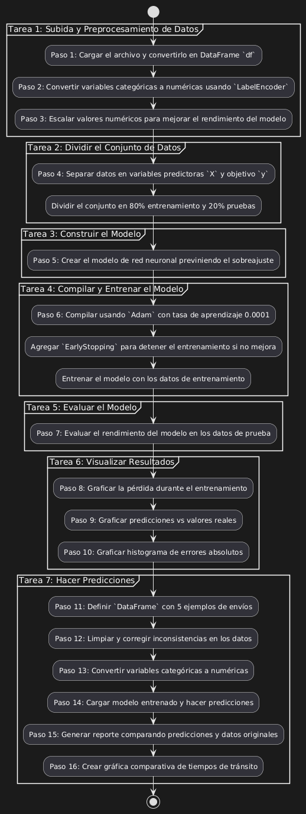
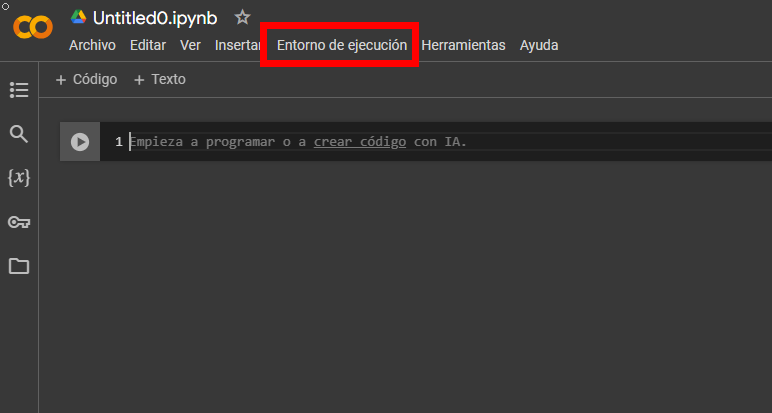
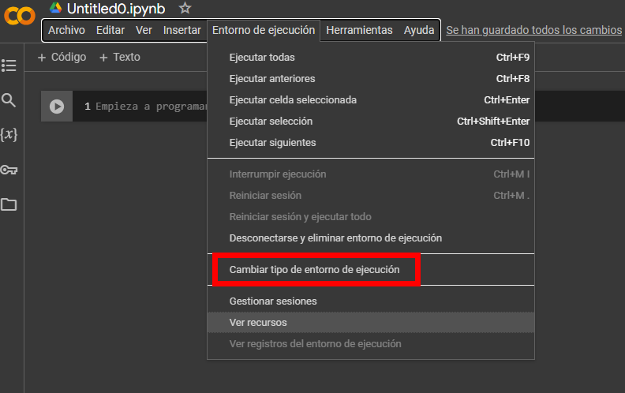
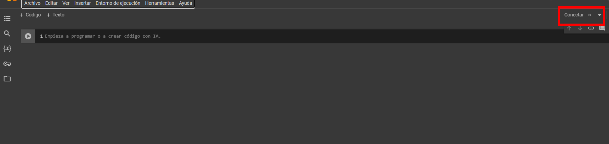
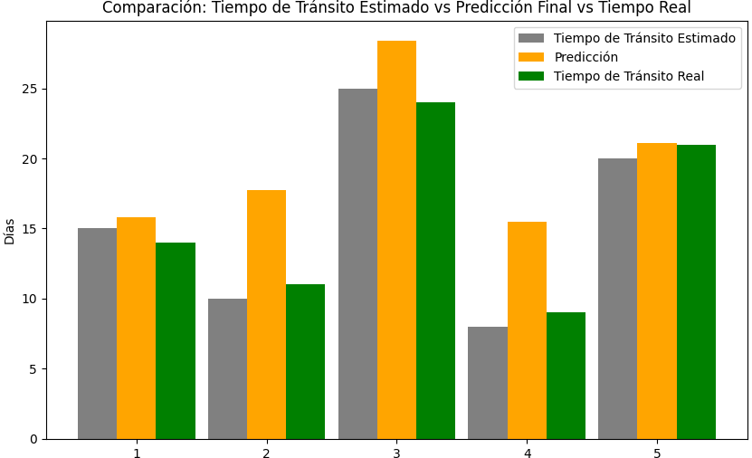

# Predicción del Tiempo de Tránsito en Envíos Internacionales utilizando Deep Learning

## Objetivo de la práctica:
Al finalizar la actividad, serás capaz de construir un modelo de Deep Learning que prediga con precisión el tiempo de tránsito real en envíos internacionales, tomando en cuenta variables logísticas como el país de origen, destino, tipo de carga, y posibles demoras aduaneras.

## Objetivo Visual 



## Duración aproximada:
- 50 minutos.

## Instrucciones 

### **CONFIGURACIÓN DEL ENTORNO DE TRABAJO**

Dentro de Google Drive, seleccionar `Nuevo`


Dar clic en `Más` y `Conectar con más aplicaciones`


En el buscador escribir `Colab` y seleccionar el que dice `Colaboratory`


Dar clic en `Instalar`


En `Nuevo`, seleccionar `Colaboratory`


Cuando se abra un nuevo archivo, seleccionar `Entorno de ejecución`


Seleccionar `Cambiar tipo de entorno de ejecución`



Seleccionar `T4 GPU` y dar clic en `Guardar`


Finalmente, conectarse a los recursos seleccionados



### Tarea 1. **Subida y preprocesamiento de Datos**
Paso 1. Cargar el archivo al entorno de Colab y convertirlo en un DataFrame llamado `df`.

```python
import numpy as np
import pandas as pd
from sklearn.preprocessing import LabelEncoder, StandardScaler
from sklearn.model_selection import train_test_split
from sklearn.metrics import r2_score
from tensorflow.keras.models import Sequential
from tensorflow.keras.layers import Dense, Dropout
from tensorflow.keras.optimizers import Adam
from tensorflow.keras.callbacks import EarlyStopping, ReduceLROnPlateau
import matplotlib.pyplot as plt
from google.colab import files
from tensorflow.keras.models import load_model

uploaded = files.upload()
df = pd.read_csv('datos_aduana_capitulo_4.csv')
```

Paso 2. Convertir variables categóricas como `Origin Country` o `Customs Status`a valores numéricos usando `LabelEncoder`.

```python
df_clean = df.drop(['Shipment ID', 'Entry Date', 'Release Date', 'Delay Days'], axis=1)
categorical_columns = ['Origin Country', 'Destination Country', 'Good Type', 'Route', 'Customs Status', 'Delay', 'Inconsistencies']
label_encoders = {}
for col in categorical_columns:
    le = LabelEncoder()
    df_clean[col] = le.fit_transform(df_clean[col])
    label_encoders[col] = le
```

Paso 3. Escalar los valores numéricos como `Weight (Tons)` y `Estimated Transit Time` para mejorar la performance del modelo.

```python
scaler = StandardScaler()
df_clean[['Weight (Tons)', 'Estimated Transit Time (days)']] = scaler.fit_transform(df_clean[['Weight (Tons)', 'Estimated Transit Time (days)']])
```

### Tarea 2. **Dividir el Conjunto de Datos**

Paso 4. Separar los datos en variables predictoras (X) y el objetivo (y), y el conjunto se debe dividir en 80% para entrenamiento y 20% para pruebas.

 ```python
X = df_clean.drop('Real Transit Time (days)', axis=1)
y = df_clean['Real Transit Time (days)']
X_train, X_test, y_train, y_test = train_test_split(X, y, test_size=0.2, random_state=42)
 ```

### Tarea 3. **Construir el Modelo**

Paso 5. Crear el modelo de red neuronal previniendo el sobreajuste: La red contiene 3 capas, dos densas (128 y 64 neuronas) con activación `ReLU` y una capa de salida con 1 neurona (predicción del tiempo de tránsito).

```python
model = Sequential()
model.add(Dense(128, activation='relu', input_shape=(X_train.shape[1],)))
model.add(Dropout(0.3))
model.add(Dense(64, activation='relu'))
model.add(Dropout(0.3))
model.add(Dense(1))
```

### Tarea 4. **Compilar y entrenar el Modelo**

Paso 6. Compilar usando el algoritmo Adam con una tasa de aprendizaje de 0.0001, con `mean_absolute_error` como función de pérdida, y agregando `EarlyStopping` para detener el entrenamiento si la validación no mejora 

```python
model.compile(optimizer=Adam(learning_rate=0.0001), loss='mean_absolute_error')
early_stopping = EarlyStopping(monitor='val_loss', patience=10, restore_best_weights=True)
reduce_lr = ReduceLROnPlateau(monitor='val_loss', factor=0.1, patience=5, min_lr=1e-6)
history = model.fit(X_train, y_train, epochs=100, batch_size=64, validation_data=(X_test, y_test), callbacks=[early_stopping, reduce_lr])
```

### Tarea 5. **Evaluar el Modelo**

Paso 7. Evaluar qué tan bien el modelo predice el valor objetivo.

```python
loss = model.evaluate(X_test, y_test)
y_pred = model.predict(X_test).flatten()
r2 = r2_score(y_test, y_pred)
```

### Tarea 6. **Visualizar Resultados**

Paso 8. Graficar la pérdida durante el entrenamiento

```python
plt.plot(history.history['loss'], label='Entrenamiento')
plt.plot(history.history['val_loss'], label='Validación')
```

Paso 9. Graficar las predicciones vs valores reales:
```python
plt.scatter(y_test, y_pred, alpha=0.5)
```

Paso 10. Graficar un histograma de errores absolutos:
```python
errors = np.abs(y_test - y_pred)
plt.hist(errors, bins=30, color='blue', alpha=0.7)
```

### Tarea 7. **Hacer Predicciones**

Paso 11. Definir un **DataFrame** con 5 ejemplos de envíos donde cada fila representa un envío que serán usados para hacer predicciones después de pasar por un proceso de preprocesamiento, además se agregará la columna con el tiempo real de un envío.

```python
model.save('modelo_red_neuronal_trafico_mercancias_mejorado.keras')
nuevos_datos_sin_transformar = pd.DataFrame({
    'Origin Country': ['USA', 'China', 'Germany', 'Brazil', 'USA'],
    'Destination Country': ['China', 'USA', 'Brazil', 'Germany', 'Germany'],
    'Weight (Tons)': [50.5, 20.0, 75.3, 10.0, 45.0],
    'Good Type': ['Electronics', 'Textiles', 'Food', 'Electronics', 'Food'],
    'Estimated Transit Time (days)': [15, 10, 25, 8, 20],
    'Route': ['Route A', 'Route B', 'Route C', 'Route A', 'Route B'],
    'Customs Status': ['Released', 'Under Review', 'Released', 'Under Review', 'Released'],
    'Delay': ['Yes', 'No', 'Yes', 'No', 'Yes'],
    'Inconsistencies': ['No', 'Yes', 'No', 'Yes', 'No'],
    'Real Transit Time (days)': [14, 11, 24, 9, 21]  
})
```

Paso 12. Limpiar y corregir inconsistencias en los datos borrando cualquier fila duplicada que pueda existir y rellenando con la media los valores faltantes en las columnas numéricas.

```python
def corregir_datos(df):
    df = df.drop_duplicates()

    num_columns = ['Weight (Tons)', 'Estimated Transit Time (days)']
    for col in num_columns:
        if df[col].isnull().sum() > 0:
            df[col].fillna(df[col].mean(), inplace=True)

    cat_columns = ['Origin Country', 'Destination Country', 'Good Type', 'Route', 'Customs Status', 'Delay', 'Inconsistencies']
    for col in cat_columns:
        if df[col].isnull().sum() > 0:
            df[col].fillna(df[col].mode()[0], inplace=True)

    df['Delay'] = df['Delay'].replace({'yes': 'Yes', 'no': 'No'})

    return df
```

Paso 13. Convertir las variables categóricas como `'Origin Country'`, `'Destination Country'`, `'Good Type'`, etc, a valores numéricos para que el modelo de red neuronal pueda procesarlas.

```python
nuevos_datos_sin_transformar = corregir_datos(nuevos_datos_sin_transformar)

nuevos_datos = nuevos_datos_sin_transformar.copy()

categorical_columns = ['Origin Country', 'Destination Country', 'Good Type', 'Route', 'Customs Status', 'Delay', 'Inconsistencies']
label_encoders = {}
for col in categorical_columns:
    le = LabelEncoder()
    nuevos_datos[col] = le.fit_transform(nuevos_datos[col])
    label_encoders[col] = le

scaler = StandardScaler()
nuevos_datos[['Weight (Tons)', 'Estimated Transit Time (days)']] = scaler.fit_transform(nuevos_datos[['Weight (Tons)', 'Estimated Transit Time (days)']])
```

Paso 14. Cargar un modelo de red neuronal previamente entrenado y utilizar los datos transformados para hacer predicciones del tiempo de tránsito. 

```python
X_nuevos_datos = nuevos_datos.drop('Real Transit Time (days)', axis=1)
model = load_model('modelo_red_neuronal_trafico_mercancias_mejorado.keras')
predicciones = model.predict(X_nuevos_datos).flatten()
```

Paso 15. Generar un reporte que compare la predicción del modelo con los datos originales, mostrando información clave como el país de origen, destino, tipo de carga, y los tiempos de tránsito estimado, real y predicho.

```python
for i, prediccion in enumerate(predicciones):
    print("═════════════════════════════════════════════════════════════════════")
    print(f"                      **REPORTE DE PREDICCIÓN: ENVÍO {i+1}**")
    print("═════════════════════════════════════════════════════════════════════")
    print(f"┃ **País de Origen:**              {nuevos_datos_sin_transformar.iloc[i]['Origin Country']}")
    print(f"┃ **País de Destino:**             {nuevos_datos_sin_transformar.iloc[i]['Destination Country']}")
    print(f"┃ **Tipo de Carga:**               {nuevos_datos_sin_transformar.iloc[i]['Good Type']}")
    print(f"┃ **Peso del Envío (Tons):**       {nuevos_datos_sin_transformar.iloc[i]['Weight (Tons)']:.2f} tons")
    print(f"┃ **Tiempo de Tránsito Estimado:** {nuevos_datos_sin_transformar.iloc[i]['Estimated Transit Time (days)']} días")
    print(f"┃ **Demoras:**                     {nuevos_datos_sin_transformar.iloc[i]['Delay']}")
    print(f"┃ **Predicción Final:**            {prediccion:.0f} días")
    print(f"┃ **Tiempo de Tránsito Real:**     {nuevos_datos_sin_transformar.iloc[i]['Real Transit Time (days)']} días")
    print("═════════════════════════════════════════════════════════════════════")

    print("**Análisis de la Predicción:**")
    print(f"┗ Basado en múltiples factores, la predicción es de aproximadamente {prediccion:.0f} días.")
    print("    • **Origen y Destino:** El país de origen y destino influyen en las rutas disponibles y el tiempo de tránsito esperado.")
    print(f"      - Origen: {nuevos_datos_sin_transformar.iloc[i]['Origin Country']}")
    print(f"      - Destino: {nuevos_datos_sin_transformar.iloc[i]['Destination Country']}")
    print(f"    • **Tipo de Carga:** La carga de tipo {nuevos_datos_sin_transformar.iloc[i]['Good Type']} puede estar sujeta a regulaciones específicas.")
    print(f"    • **Condiciones de Tránsito:** Se consideraron demoras: {'Sí' if nuevos_datos_sin_transformar.iloc[i]['Delay'] == 'Yes' else 'No'}.")
    print("═════════════════════════════════════════════════════════════════════\n")
```

Paso 16. Crear una gráfica de barras comparando el tiempo de tránsito estimado, el tiempo real y la predicción realizada por el modelo, para visualizar la precisión del modelo.

```python
transito_estimado = nuevos_datos_sin_transformar['Estimated Transit Time (days)'].values
transito_real = nuevos_datos_sin_transformar['Real Transit Time (days)'].values
predicciones_finales = predicciones
num_envios = len(transito_estimado)
envios = np.arange(1, num_envios + 1)
plt.figure(figsize=(10, 6))
plt.bar(envios - 0.3, transito_estimado, width=0.3, label='Tiempo de Tránsito Estimado', color='gray')
plt.bar(envios, predicciones_finales, width=0.3, label='Predicción', color='orange')
plt.bar(envios + 0.3, transito_real, width=0.3, label='Tiempo de Tránsito Real', color='green')
plt.xlabel('Número de Envío')
plt.ylabel('Días')
plt.title('Comparación: Tiempo de Tránsito Estimado vs Predicción Final vs Tiempo Real')
plt.xticks(envios)
plt.legend()
plt.show()
```

### Resultado esperado

 
