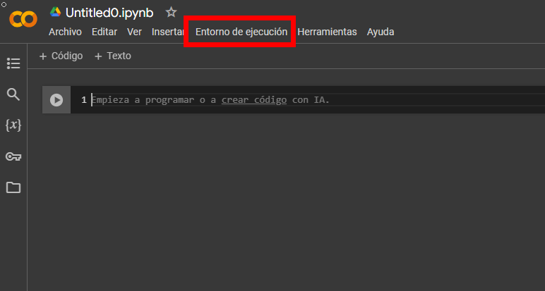
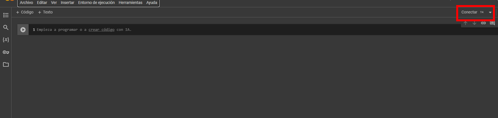

# Práctica 5. Predicción del tiempo de tránsito en envíos internacionales utilizando Deep Learning

## Objetivo de la práctica:
Al finalizar la actividad, serás capaz de:

- Aplicar técnicas de deep learning para realizar análisis de sentimientos en redes sociales, desarrollando un modelo que identifique y clasifique opiniones de usuarios de aerolíneas en distintas categorías. 
- Preprocesar texto logrando extraer información valiosa a partir de grandes volúmenes de datos textuales.

## Objetivo visual:


## Duración aproximada:

- 55 minutos.

## Instrucciones:

### Configuración del entorno de trabajo.

Dentro de Google Drive, selecciona `Nuevo`.


Dar clic en `Más` y `Conectar con más aplicaciones`.


En el buscador, escribe `Colab` y selecciona `Colaboratory`.


Da clic en `Instalar`.


En `Nuevo`, selecciona `Colaboratory`.


Cuando se abra un nuevo archivo, selecciona `Entorno de ejecución`.



Selecciona `Cambiar tipo de entorno de ejecución`.


Selecciona `T4 GPU` y da clic en `Guardar`.


Finalmente, conéctate a los recursos seleccionados.



### Tarea 1. **Instalación y descarga de datos**.

**Paso 1.** Instala la biblioteca Kaggle, descarga el [conjunto de datos de sentimientos de publicaciones en Twitter relacionado con aerolíneas](https://www.kaggle.com/datasets/crowdflower/twitter-airline-sentiment), y descomprímelos para su uso.

```python
!pip install kaggle
!kaggle datasets download -d crowdflower/twitter-airline-sentiment
!unzip twitter-airline-sentiment.zip
```

**Paso 2.** Importa las bibliotecas necesarias para: procesamiento de datos (pandas, numpy), procesamiento de texto (nltk y re), visualización (matplotlib y seaborn), división de datos y métricas de evaluación (sklearn), y el manejo de redes neuronales recurrentes (tensorflow.keras).

```python
import pandas as pd
import numpy as np
import re
import nltk
from nltk.corpus import stopwords
from nltk.stem import WordNetLemmatizer
import matplotlib.pyplot as plt
import seaborn as sns
from sklearn.model_selection import train_test_split
from sklearn.metrics import classification_report, accuracy_score, confusion_matrix
from tensorflow.keras.preprocessing.text import Tokenizer
from tensorflow.keras.preprocessing.sequence import pad_sequences
from tensorflow.keras.models import Sequential
from tensorflow.keras.layers import Dense, Embedding, LSTM, Dropout
from keras.utils import to_categorical
```

**Paso 3.** Cargar el archivo _Tweets.csv_ en un DataFrame de Pandas.

```python
df = pd.read_csv('Tweets.csv')
```

### Tarea 2. **Preprocesamiento de datos**.

**Paso 4.** Descarga los recursos de NLTK necesarios para eliminar palabras comunes (stopwords), lematización (wordnet) y tokenización (punkt).

 ```python
nltk.download('stopwords')
nltk.download('wordnet')
nltk.download('punkt')
 ```

**Paso 5.** Limpia cada tweet para eliminar enlaces y menciones, caracteres especiales y números, además de convertir el texto a minúsculas y tokenizarlo. También lematiza las palabras para reducirlas a su forma raíz y aplicar esta función a la columna text para crear una nueva columna cleaned_text con los tweets preprocesados.

```python
def clean_text(text):
    text = re.sub(r'http\S+|www\S+|@\w+', '', text)
    text = re.sub(r'[^a-zA-Z\s]', '', text)
    text = text.lower()
    words = nltk.word_tokenize(text)
    lemmatizer = WordNetLemmatizer()
    words = [lemmatizer.lemmatize(word) for word in words if len(word) > 1]
    return ' '.join(words)

df['cleaned_text'] = df['text'].apply(clean_text)
```

**Paso 6.** Conviertir los sentimientos (negative, neutral, positive) en valores numéricos (0, 1, 2).

```python
label_mapping = {'negative': 0, 'neutral': 1, 'positive': 2}
df['label'] = df['airline_sentiment'].map(label_mapping)
```

**Paso 7.** Asigna los textos limpios a `X` (entrada) y las etiquetas a `y` (salida).

```python
X = df['cleaned_text']
y = df['label']
```

**Paso 8.** Define el número máximo de palabras únicas y la longitud máxima de secuencia, y crea un Tokenizer para asignar números a las palabras ajustando su longitud para que todas las secuencias tengan la misma longitud.

```python
max_words = 5000
max_len = 100
tokenizer = Tokenizer(num_words=max_words)
tokenizer.fit_on_texts(X)
X_sequences = tokenizer.texts_to_sequences(X)
X_padded = pad_sequences(X_sequences, maxlen=max_len)
```

**Paso 9.** Divide los datos en conjuntos de entrenamiento y prueba (80% y 20%, respectivamente) manteniendo la distribución de clases.

```python
X_train, X_test, y_train, y_test = train_test_split(
    X_padded, y, test_size=0.2, stratify=y, random_state=42
)
```

### Tarea 3. **Construcción y entrenamiento de la red neuronal**.

**Paso 10.** Construye una red neuronal con las siguientes capas:

- Embedding para aprender una representación vectorial de las palabras.
- LSTM para capturar dependencias en las secuencias.
- Dense con softmax para la clasificación final.

Compila el modelo utilizando la pérdida _categorical_crossentropy_ y el optimizador Adam.

```python
y_train_categorical = to_categorical(y_train, num_classes=3)
y_test_categorical = to_categorical(y_test, num_classes=3)

model = Sequential()
model.add(Embedding(input_dim=max_words, output_dim=128, input_length=max_len))
model.add(LSTM(64, dropout=0.2, recurrent_dropout=0.2))
model.add(Dense(3, activation='softmax'))
model.compile(loss='categorical_crossentropy', optimizer='adam', metrics=['accuracy'])
```

**Paso 11.** Entrena el modelo con 5 épocas y un tamaño de lote de 64, reservando el 10% del conjunto de entrenamiento para validación.

```python
epochs = 5
batch_size = 64
history = model.fit(
    X_train, y_train_categorical,
    epochs=epochs,
    batch_size=batch_size,
    validation_split=0.1
)
```

### Tarea 4. **Prueba del modelo**.

**Paso 12.** Evalúa el modelo con el conjunto de prueba y mostrar la precisión, el reporte de clasificación y la matriz de confusión.

```python
loss, accuracy = model.evaluate(X_test, y_test_categorical)
print(f"Accuracy en conjunto de prueba: {accuracy}")
y_pred_prob = model.predict(X_test)
y_pred = np.argmax(y_pred_prob, axis=1)
print(classification_report(y_test, y_pred, digits=4))
cm = confusion_matrix(y_test, y_pred)
plt.figure(figsize=(8,6))
sns.heatmap(cm, annot=True, fmt='d', cmap='Blues',
            xticklabels=['Negative', 'Neutral', 'Positive'],
            yticklabels=['Negative', 'Neutral', 'Positive'])
plt.ylabel('Actual')
plt.xlabel('Predicted')
plt.title('Confusion Matrix')
plt.show()

```

### Tarea 4. **Realizar predicciones**.

**Paso 13.** Evaluar manualmente el rendimiento del modelo con tweets en inglés e imprimiendo sus resultados.

```python

new_tweets = [
    "The flight attendants were so helpful and friendly! Great service overall!",  # Positivo
    "Loved the experience, arrived early and everything went smoothly. Will fly again!",  # Positivo
    "Horrible experience, the flight was delayed for hours and the staff was rude.",  # Negativo
    "Never flying with this airline again! Lost my bags and terrible customer service.",  # Negativo

    "The flight was amazing! The crew went above and beyond to make sure we were comfortable.",  # Positivo
    "Worst airline ever. The plane was filthy, and the seats were broken.",  # Negativo

]

translations = [
    "Los asistentes de vuelo fueron muy serviciales y amables. ¡Un gran servicio en general!",  # Positivo
    "Me encantó la experiencia, llegamos temprano y todo salió bien. ¡Volveré a volar con ellos!",  # Positivo
    "Horrible experiencia, el vuelo se retrasó por horas y el personal fue grosero.",  # Negativo
    "Nunca volveré a volar con esta aerolínea. Perdieron mis maletas y el servicio al cliente fue terrible.",  # Negativo

    "El vuelo fue increíble. La tripulación hizo todo lo posible para asegurarse de que estuviéramos cómodos.",  # Positivo
    "Peor aerolínea de todas. El avión estaba sucio y los asientos estaban rotos.",  # Negativo

]

cleaned_new_tweets = [clean_text(tweet) for tweet in new_tweets]

new_sequences = tokenizer.texts_to_sequences(cleaned_new_tweets)
new_padded = pad_sequences(new_sequences, maxlen=max_len)

predictions = model.predict(new_padded)
predicted_labels = np.argmax(predictions, axis=1)

label_mapping_inverse = {v: k for k, v in label_mapping.items()}

for i, tweet in enumerate(new_tweets):
    sentiment = label_mapping_inverse[predicted_labels[i]]
    print(f"Tweet: '{tweet}'\nTraducción: '{translations[i]}'\nSentimiento predicho: {sentiment}\n")
```

**Paso 14.** Crear una función que limpia el texto de un nuevo tweet que se le solicite ingresar al usuario, lo convierte en una secuencia y predice su sentimiento.

```python
def predict_sentiment(tweet):
    cleaned_tweet = clean_text(tweet)
    tweet_sequence = tokenizer.texts_to_sequences([cleaned_tweet])
    tweet_padded = pad_sequences(tweet_sequence, maxlen=max_len)
    prediction = model.predict(tweet_padded)
    predicted_label = np.argmax(prediction, axis=1)[0]
    label_mapping_inverse = {v: k for k, v in label_mapping.items()}
    sentiment = label_mapping_inverse[predicted_label]
    print(f"Tweet: '{tweet}'\nSentimiento predicho: {sentiment}")

user_tweet = input("Escribe tu tweet: ")
predict_sentiment(user_tweet)
```

### Resultado esperado:

## Resultado 1:

 

## Resultado 2:


